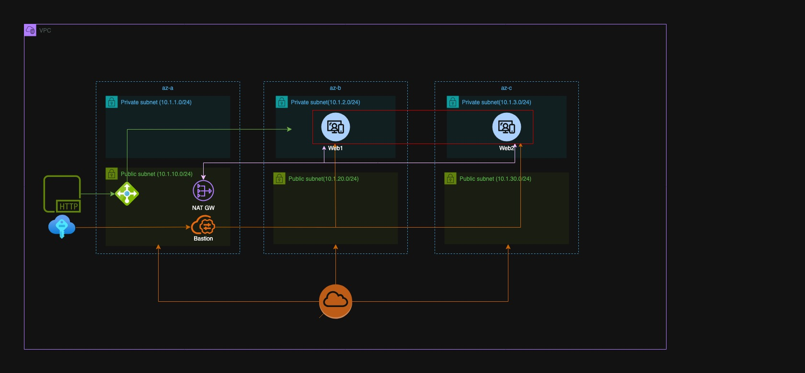
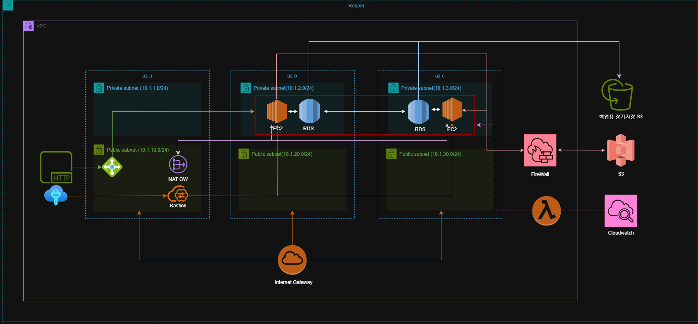

## 📌 프로젝트 개요

본 프로젝트는 **AI 분석 API 서비스 구축을 위한 AWS 인프라 아키텍처 설계**를 목표로 합니다.

- 사용자로부터 데이터를 받아 AI 분석을 수행하고 결과를 반환하는 서비스를 상정
- 서비스가 안정적이고 보안적으로 운영될 수 있도록 **가상 네트워크(VPC)** 중심의 AWS 인프라 환경을 구성

---

## 🧱 아키텍처 구성 요약

### Day 1: 기본 인프라 설계

- **가용 영역 분산(AZ-a, AZ-b, AZ-c)**  
  - Private Subnet에 Web 서버를 배치하고 NAT를 통해 외부 통신 허용  
  - Public Subnet에는 Load Balancer, NAT Gateway, Bastion Host 배치

### Day 2: 인프라 확장 설계

- **RDS**를 통한 데이터 저장소 구성  
- **S3**를 활용한 분석용 데이터 저장 및 백업 구조 설계  
- **CloudWatch**와 **Lambda**를 통한 로그 수집/모니터링  
- 방화벽 구성으로 보안성 향상

---

## ☁️ 사용된 AWS 리소스 (설계 기준)

- **VPC / Subnet** (AZ 분산)
- **EC2** (웹 서버용)
- **RDS** (분석 결과 저장)
- **S3** (데이터 저장 및 백업)
- **CloudWatch** / **Lambda** (모니터링)
- **Load Balancer**, **NAT Gateway**, **Bastion Host**

---

## 🔐 보안 설계 요소

- Private / Public Subnet 분리
- NAT Gateway를 통한 안전한 외부 통신
- Bastion Host를 통한 SSH 보안 접속
- 방화벽 구성으로 외부 트래픽 제어

---

## ✅ 프로젝트의 의의

- 실제 서비스를 위한 **클라우드 아키텍처 설계 경험** 확보  
- AWS 환경 내에서 고가용성과 보안을 고려한 인프라 구조 수립  
- 향후 AI 분석 API 서비스를 배포하는 데 기반이 될 수 있는 구조 제안## 📌 프로젝트 개요

본 프로젝트는 **AI 분석 API 서비스 구축을 위한 AWS 인프라 아키텍처 설계**를 목표로 합니다.

- 사용자로부터 데이터를 받아 AI 분석을 수행하고 결과를 반환하는 서비스를 상정
- 서비스가 안정적이고 보안적으로 운영될 수 있도록 **가상 네트워크(VPC)** 중심의 AWS 인프라 환경을 구성

---

## 🧱 아키텍처 구성 요약

### Day 1: 기본 인프라 설계

- **가용 영역 분산(AZ-a, AZ-b, AZ-c)**  
  - Private Subnet에 Web 서버를 배치하고 NAT를 통해 외부 통신 허용  
  - Public Subnet에는 Load Balancer, NAT Gateway, Bastion Host 배치

### Day 2: 인프라 확장 설계

- **RDS**를 통한 데이터 저장소 구성  
- **S3**를 활용한 분석용 데이터 저장 및 백업 구조 설계  
- **CloudWatch**와 **Lambda**를 통한 로그 수집/모니터링  
- 방화벽 구성으로 보안성 향상

---

## ☁️ 사용된 AWS 리소스 (설계 기준)

- **VPC / Subnet** (AZ 분산)
- **EC2** (웹 서버용)
- **RDS** (분석 결과 저장)
- **S3** (데이터 저장 및 백업)
- **CloudWatch** / **Lambda** (모니터링)
- **Load Balancer**, **NAT Gateway**, **Bastion Host**

---

## 🔐 보안 설계 요소

- Private / Public Subnet 분리
- NAT Gateway를 통한 안전한 외부 통신
- Bastion Host를 통한 SSH 보안 접속
- 방화벽 구성으로 외부 트래픽 제어

---

## ✅ 프로젝트의 의의

- 실제 서비스를 위한 **클라우드 아키텍처 설계 경험** 확보  
- AWS 환경 내에서 고가용성과 보안을 고려한 인프라 구조 수립  
- 향후 AI 분석 API 서비스를 배포하는 데 기반이 될 수 있는 구조 제안
